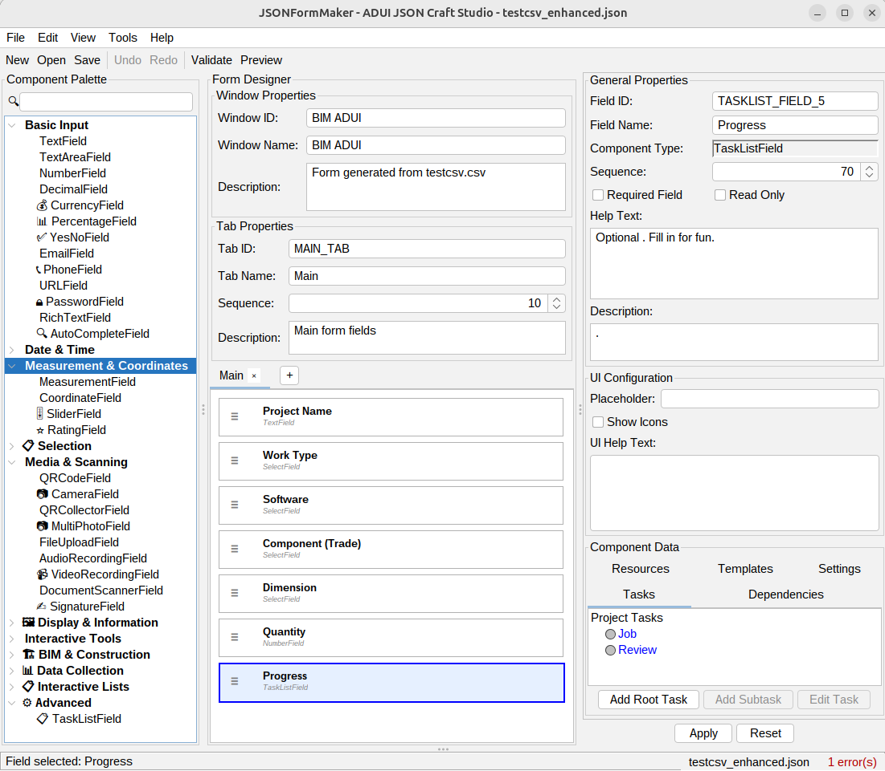

# JSONFormMaker

**Visual JSON Form Designer for ADUI Mobile Systems**

[](https://opensource.org/licenses/MIT)
[](https://adoptopenjdk.net/)
[](https://python.org/)
[](https://github.com/red1oon/JSONFormMaker/releases)

A comprehensive toolset for creating and managing JSON form configurations for ADUI mobile applications. Build professional forms using visual drag-and-drop design or convert existing CSV data into ADUI-compatible JSON formats.



## 🚀 Features

### Visual Form Designer
- **Drag & Drop Interface**: Intuitive visual form builder
- **46+ Component Types**: Text fields, dropdowns, date pickers, task lists, and more
- **Real-time Validation**: Instant feedback on form configuration
- **Template System**: Pre-built templates for common use cases
- **Cross-platform**: Works on Windows, macOS, and Linux

### CSV to JSON Converter
- **Bulk Conversion**: Transform spreadsheet data into ADUI JSON
- **Smart Detection**: Automatically handles different field types
- **Builder Compatibility**: Output matches visual designer format
- **Command Line Interface**: Perfect for automation and batch processing

### ADUI Integration
- **Mobile-First**: Designed specifically for ADUI mobile systems
- **Standard Compliance**: Follows ADUI JSON specification v2.0
- **Component Library**: Complete support for all ADUI field types
- **Validation Engine**: Ensures generated JSON is deployment-ready

## 📥 Quick Start

### Download & Install

1. **Download the latest release**:
   ```bash
   # Visit releases page and download ZIP
   https://github.com/red1oon/JSONFormMaker/releases/latest
   ```

2. **Extract and run**:
   ```bash
   # Windows
   Double-click JSONFormMaker.bat
   
   # macOS/Linux
   ./jsonformmaker.sh
   ```

3. **Requirements**:
   - Java 11 or higher
   - 512 MB RAM minimum
   - 100 MB disk space

### Create Your First Form

```bash
# 1. Start the visual designer
./jsonformmaker.sh

# 2. Or use CSV converter for existing data
python CSVtoJSON.py sample-form.csv
```

## 📖 Documentation

- **[Complete User Guide](docs/JSONFormMaker-User-Guide.md)** - Comprehensive tutorial and reference
- **[CSV Format Guide](docs/CSV-Format-Guide.md)** - CSV to JSON conversion specifications
- **[Component Reference](docs/Component-Reference.md)** - Complete ADUI component catalog
- **[Examples](examples/)** - Sample forms and templates

## 🛠️ Usage Examples

### Visual Form Designer
Create forms using the intuitive drag-and-drop interface:

1. Drag components from palette to canvas
2. Configure properties in the inspector panel
3. Preview and validate your form
4. Export to ADUI JSON format

### CSV Converter
Convert spreadsheet data to JSON forms:

```csv
Seq,Field Name,Component,Input
10,Customer Name,Text Field,
20,Age,Number Field,
30,Country,Select Field,"USA,Canada,UK,Australia"
40,Project Tasks,TaskListField,"Design,Development,Testing"
```

```bash
python CSVtoJSON.py customer-form.csv --title "Customer Registration"
```

**Output**: Professional ADUI JSON ready for mobile deployment

## 🏗️ Project Structure

```
JSONFormMaker/
├── 📁 JSONFormMaker/          # Java Swing visual designer
│   ├── src/main/java/         # Source code
│   ├── src/main/resources/    # Icons and templates
│   └── pom.xml               # Maven configuration
├── 📁 distribution/           # Build and packaging scripts
├── 📁 docs/                   # Documentation and guides
├── 📁 examples/              # Sample forms and CSV files
├── 📄 CSVtoJSON.py           # Python CSV converter
└── 📄 README.md              # This file
```

## 🔧 Development

### Building from Source

```bash
# Clone the repository
git clone https://github.com/red1oon/JSONFormMaker.git
cd JSONFormMaker

# Build the Java application
cd JSONFormMaker
mvn clean package

# Run the application
java -jar target/jsonformmaker-*-jar-with-dependencies.jar
```

### Contributing

1. Fork the repository
2. Create a feature branch (`git checkout -b feature/amazing-feature`)
3. Commit your changes (`git commit -m 'Add amazing feature'`)
4. Push to the branch (`git push origin feature/amazing-feature`)
5. Open a Pull Request

## 📋 Requirements

### System Requirements
- **Java**: 11 or higher (for visual designer)
- **Python**: 3.6+ (for CSV converter)
- **OS**: Windows 10+, macOS 10.14+, Linux Ubuntu 18.04+
- **Memory**: 512 MB RAM minimum
- **Storage**: 100 MB free space

### ADUI Compatibility
- Supports ADUI JSON specification v2.0
- Compatible with all ADUI mobile platforms
- Generates mobile-optimized form definitions
- Includes validation for deployment readiness

## 🎯 Use Cases

### Construction & Engineering
- Equipment inspection forms
- Safety checklists
- Project management tasks
- Quality control documentation

### Business Applications
- Customer registration
- Order processing
- Inventory management
- Survey and feedback forms

### Mobile Data Collection
- Field data entry
- Inspection reports
- Audit checklists
- Workflow management

## 🔄 Workflow Integration

### Design → Deploy Process
1. **Design**: Use visual designer or CSV converter
2. **Validate**: Built-in validation ensures correctness
3. **Export**: Generate ADUI-compatible JSON
4. **Deploy**: Upload to ADUI mobile system
5. **Collect**: Users fill forms on mobile devices

### Team Collaboration
- **Designers**: Use visual interface for complex forms
- **Data Analysts**: Convert spreadsheets with CSV tool
- **Developers**: Integrate via JSON export/import
- **End Users**: Professional mobile form experience

## 📊 Component Support

| Category | Components | Use Cases |
|----------|------------|-----------|
| **Text Input** | TextField, TextArea, RichText | Names, descriptions, comments |
| **Numeric** | NumberField, Currency, Percentage | Quantities, prices, ratings |
| **Selection** | SelectField, Radio, Checkbox | Options, preferences, categories |
| **Date/Time** | DatePicker, TimePicker, DateTime | Schedules, deadlines, timestamps |
| **Advanced** | TaskList, QRScanner, FileUpload | Workflows, scanning, documents |
| **Layout** | Tabs, Sections, Spacers | Organization, grouping, design |

## 🎮 Demo & Examples

### Live Examples
- **[Equipment Inspection](examples/equipment-inspection.json)** - Industrial equipment checklist
- **[Customer Survey](examples/customer-survey.json)** - Feedback collection form
- **[Project Tasks](examples/project-tasks.json)** - Project management workflow

### Sample CSV Files
- **[Basic Contact Form](examples/contact-form.csv)** - Simple contact information
- **[Inspection Checklist](examples/inspection-checklist.csv)** - Equipment inspection
- **[Task Management](examples/task-management.csv)** - Project task workflow

## 🐛 Support & Issues

### Getting Help
- **📖 Documentation**: Check the [User Guide](docs/JSONFormMaker-User-Guide.md) first
- **🐛 Bug Reports**: [Create an issue](https://github.com/red1oon/JSONFormMaker/issues) with details
- **💡 Feature Requests**: [Open a discussion](https://github.com/red1oon/JSONFormMaker/discussions) for new ideas
- **📧 Direct Support**: red1rg@gmail.com

### Reporting Issues
When reporting bugs, please include:
- Operating system and version
- Java version (`java -version`)
- Steps to reproduce the issue
- Screenshots if applicable
- Sample files (CSV/JSON) if relevant

## 📄 License

This project is licensed under the MIT License - see the [LICENSE](LICENSE) file for details.

**Copyright © 2025 Redhuan D. OON (CTFL)**

Permission is hereby granted, free of charge, to any person obtaining a copy of this software and associated documentation files (the "Software"), to deal in the Software without restriction, including without limitation the rights to use, copy, modify, merge, publish, distribute, sublicense, and/or sell copies of the Software, and to permit persons to whom the Software is furnished to do so, subject to the following conditions:

The above copyright notice and this permission notice shall be included in all copies or substantial portions of the Software.

## 🏢 About

**JSONFormMaker** is developed and maintained by:

**Redhuan D. OON (CTFL)**  
BIM Experts, Ikthisas IT  
Malaysia  
📧 red1rg@gmail.com

### Professional Background
- Certified Tester Foundation Level (CTFL)
- BIM (Building Information Modeling) Expert
- Software Development & Quality Assurance
- Mobile Application Development for Construction Industry

## 🔗 Related Projects

- **ADUI Framework**: Mobile application framework for construction and engineering
- **BIM Integration Tools**: Building Information Modeling utilities
- **Mobile Data Collection**: Field data gathering solutions

## 🎉 Acknowledgments

- ADUI development team for mobile framework specifications
- Java Swing community for UI component libraries
- Open source contributors and testers
- Construction industry professionals for requirements feedback

---

**⭐ Star this repository if JSONFormMaker helps with your mobile form development!**

**🔄 Watch for updates and new features**

**🍴 Fork to contribute improvements and extensions**